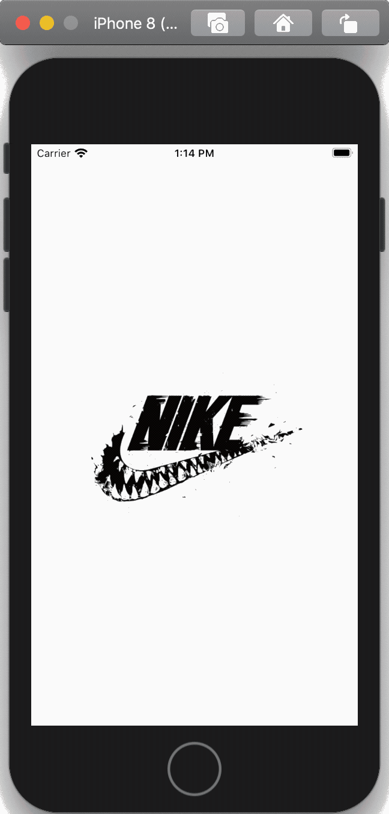
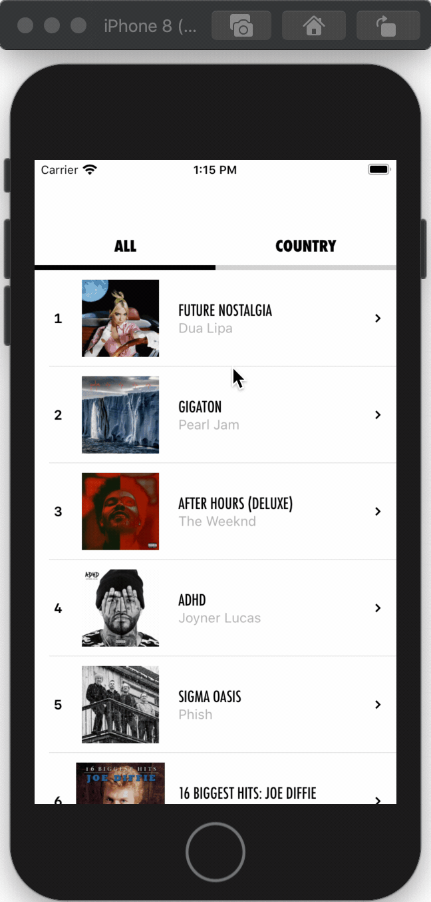
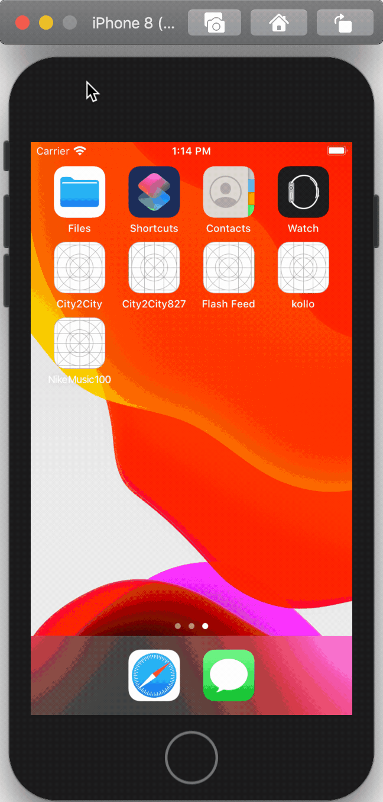
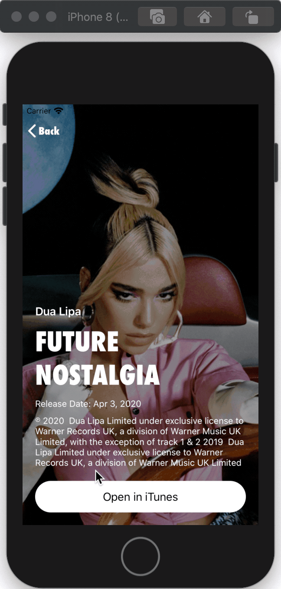
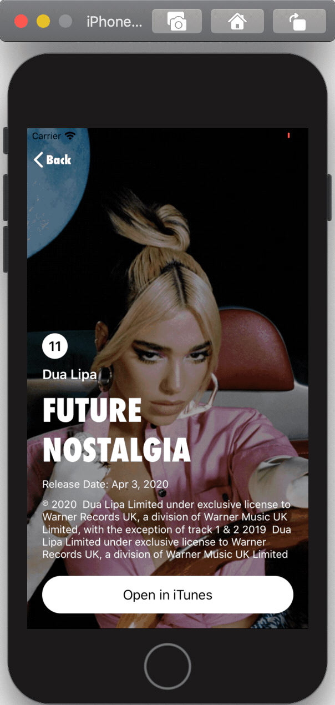
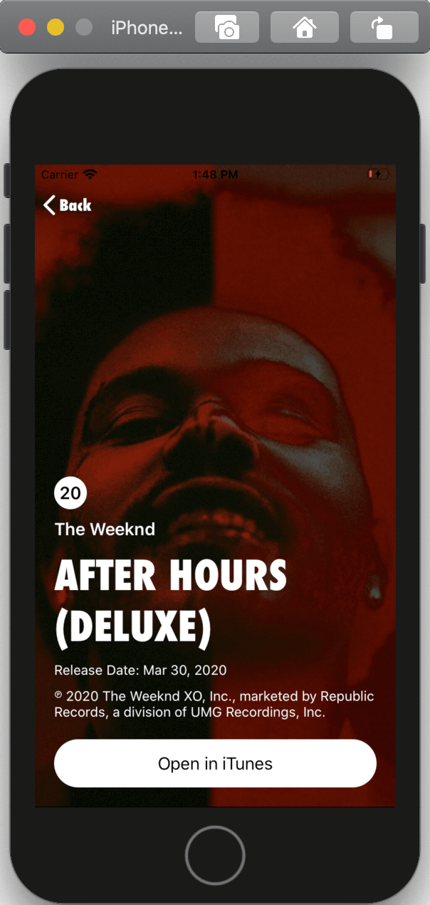

# Nike Coding Challenge

## 1. Overview
### 1.1. App Description
**Nike Music 100** is a sample app meeting the Nike Coding Challenge requirements leveraging **Apple's RSS Feed Generator** to display the top 100 music album ranking on iTunes

### 1.2. Development (Conditions)
The Sample app was developed using Swift in just under 24 hours.
About a couple of those 24 hours were dedicated to an extensive UX/UI research to match Nike's branding as observed in their current AppStore apps

### 1.3. Issues
Althought one of the requierements for this challenge was presenting all possible **genres** of music, it seems the RSS Feed Generator currently only support *all genres* and *country music*. 

## 2. Requirements
- Create a sample iPhone app that displays the top 100 albums across all genres using Apple’s RSS generator
- Use a `UITableView` showing one album per cell. 
- Each `UITableViewCell` should display the name of the album, the artist, and the album art (thumbnail image). 
- Tapping on a cell should push another view controller onto the navigation stack
- `DetailViewController` should include a larger image at the top of the screen and the same information that was shown on the cell, plus genre, release date, and copyright info below the image. 
- in `DetailViewController` a button should be included. When tapped, this button should open the album page in the iTunes store.
- The button should be centered horizontally and pinned 20 points from the bottom of the view and 20 points from the leading and trailing edges of the view.

**The DON'Ts:**
- `DetailViewController` **should NOT** use a UITableView for layout.
- **DO NOT** use storyboards and/or nibs
- **DO NOT** use force unwrap statements
- **DO NOT** use any third-party libraries

## 3. UI/UX
**Current Nike App:**
        

**Nike Music 100 (Sample App)**
        

## 4. Alternative App
While developing the app, some Nike core UI/UX were not implementable with the original set of requirements. Therefore, a need for creating an *alternative* design to go along the coding challenge quickly arise.

At launch, users can switch to the alternative design as needed

**Nike Music 100 (Alternative)**
        

## 4. Discussion
With more development time, the items below would be implemented next (there's just so much lines one can code in just 24 hours).

The following items will developed/implemented next:
- Integrating `CoreData` to limit network usage and save already fetched albums
- using a `UIPageViewController` to swipe between albums in `DetailAlternativeViewController`
- adding a `UIGestureRecognizer` allowing users to dismiss the screen by simply swiping down (in Detail View Controller)
- adding a *Throttler* in `HomeViewController` to limit network requests in case users scroll fast

## 5. Any Thoughts?
If you like this sample app, feel free to check out my other GitHub repositories.
You can also contact me at *jonathan.sack91@gmail.com* if you have any questions
