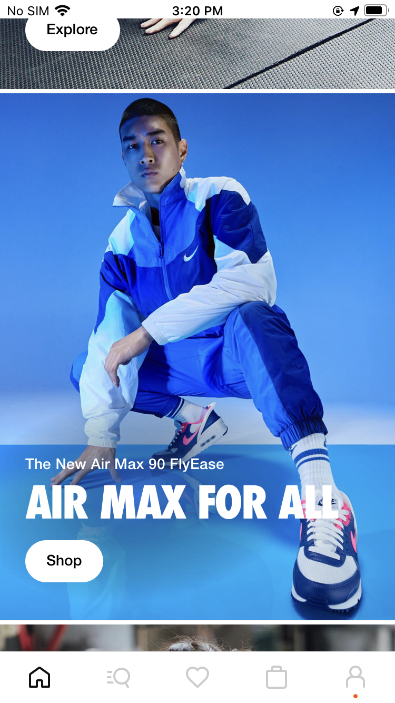
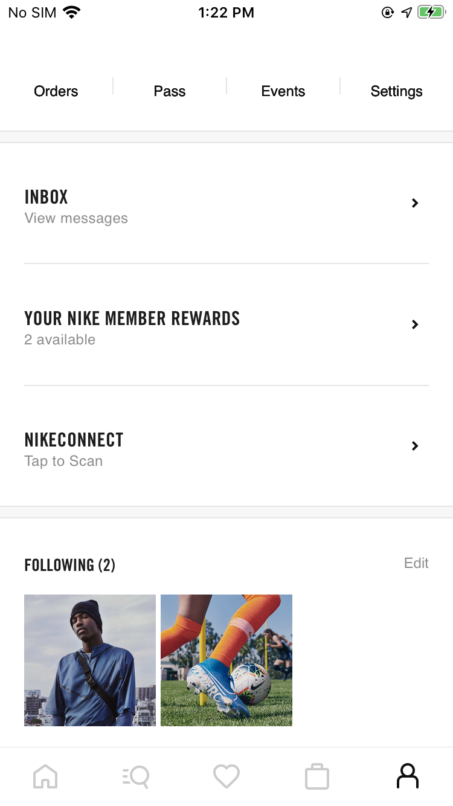
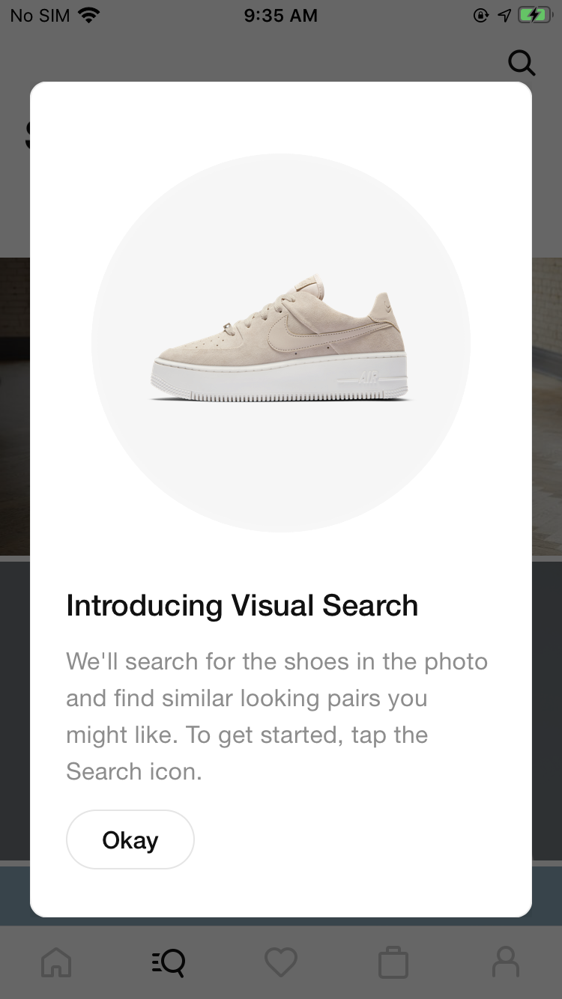
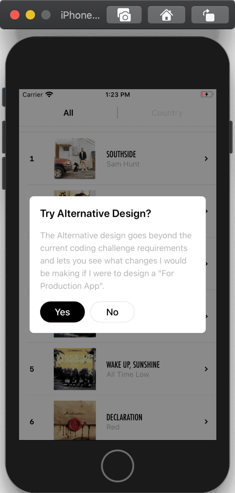
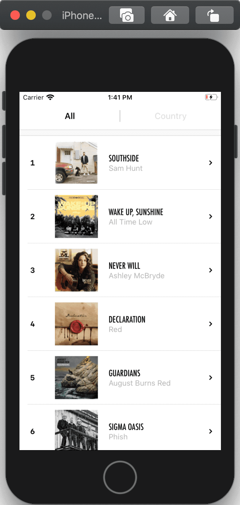

# Nike Coding Challenge

## 1. Overview
### 1.1. App Description
**Nike Music 100** is a sample app meeting the Nike Coding Challenge requirements leveraging **Apple's RSS Feed Generator** to display the top 100 music album ranking on iTunes

### 1.2. Development (Conditions)
The Sample app was developed using Swift in just under 24 hours.
About a couple of those 24 hours were dedicated to an extensive UX/UI research to match Nike's branding as observed in their current AppStore apps

**UPDATE:** I was actually told to disregard the time restriction, so I worked a little bit more on the sample app to clean and refactor code

### 1.3. Issues
- Althought one of the requierements for this challenge was presenting all possible **genres** of music, it seems the RSS Feed Generator currently only support *all genres* and *country music*. 
- Though, this feature is **fully functional on physical devices**, it is not possible to open Itunes from the sample App **on iOS simulators** (They do not have it pre-installed)

## 2. Requirements
- Create a sample iPhone app that displays the top 100 albums across all genres using Apple’s RSS generator
- Use a `UITableView` showing one album per cell. 
- Each `UITableViewCell` should display the name of the album, the artist, and the album art (thumbnail image). 
- Tapping on a cell should push another view controller onto the navigation stack
- `DetailViewController` should include a larger image at the top of the screen and the same information that was shown on the cell, plus genre, release date, and copyright info below the image. 
- in `DetailViewController` a button should be included. When tapped, this button should open the album page in the iTunes store.
- The button should be centered horizontally and pinned 20 points from the bottom of the view and 20 points from the leading and trailing edges of the view.

**The DON'Ts:**
- `DetailViewController` **should NOT** use a UITableView for layout.
- **DO NOT** use storyboards and/or nibs
- **DO NOT** use force unwrap statements
- **DO NOT** use any third-party libraries

## 3. UI/UX
**Current Nike App:** 
 
        
 
 

**Nike Music 100 (Sample App)**
 
        
 
 

## 4. Alternative App
While developing the app, some Nike core UI/UX were not implementable with the original set of requirements. Therefore, a need for creating an *alternative* design to go along the coding challenge quickly arise.

At launch, users can switch to the alternative design as needed
 

 
 

**Nike Music 100 (Alternative)**
 
       
 
 

## 5. Any Thoughts?
If you like this sample app, feel free to check out my other GitHub repositories.
You can also contact me on [LinkedIn](https://www.linkedin.com/in/jonathan-sack/) if you have any questions
